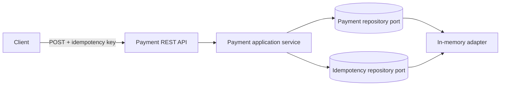

# Payment Reliability Lab

A production-minded reference system that demonstrates how a payment platform can
accept retries safely, process events reliably, and remain observable under failure.

## Reliability thesis

The transport may deliver a message more than once, but the business operation must
have exactly one effect.

## First milestone

- Create a payment through a Spring Boot API.
- Retrieve a payment by its ID.
- Require a merchant-scoped idempotency key.
- Replay the original result for an identical retry.
- Reject reuse of the same key with different payment details.

Later milestones add PostgreSQL, Kafka, the transactional outbox pattern, retries,
timeouts, circuit breakers, a dead-letter queue, OpenTelemetry, load tests, and a
small React operations console.

## Current architecture



The domain and application layers do not depend on Spring or a database. Repository
ports make the persistence technology replaceable, while HTTP concerns remain in
the API adapter.

## Local prerequisites

- Java 17 or newer
- Maven 3.9+
- Docker Desktop

## Start PostgreSQL

Create your ignored local environment file, then start the database:

```bash
cp .env.example .env
docker compose up -d postgres
docker compose ps
```

The database listens only on `127.0.0.1`, and its data persists in a named Docker
volume across container restarts.

## Verify

```bash
mvn verify
```

The build fails if line coverage drops below 80%.

## Run the API

```bash
mvn spring-boot:run
```

Create a payment:

```bash
curl -i -X POST http://localhost:8080/api/v1/payments \
  -H 'Content-Type: application/json' \
  -H 'X-Merchant-Id: demo-merchant' \
  -H 'Idempotency-Key: demo-order-1001' \
  --data '{"amount":42.50,"currency":"USD"}'
```

Repeat the command without changing the body. The first response is `201 Created`
with `Idempotency-Replayed: false`; the retry is `200 OK` with
`Idempotency-Replayed: true` and the same payment ID.

Retrieve the payment using the `id` from either response:

```bash
curl -i http://localhost:8080/api/v1/payments/{payment-id}
```

An unknown payment ID returns an RFC 7807 problem response with HTTP `404`.

## Current limitation

This first learning slice uses in-memory storage. It proves the API and domain
contract, but data is lost on restart and simultaneous requests across service
instances are not yet protected. The next milestone replaces the adapters with a
PostgreSQL transaction and a unique merchant/idempotency-key constraint.

## Architecture decisions

- [ADR-001: Merchant-scoped idempotency](docs/decisions/ADR-001-merchant-scoped-idempotency.md)
