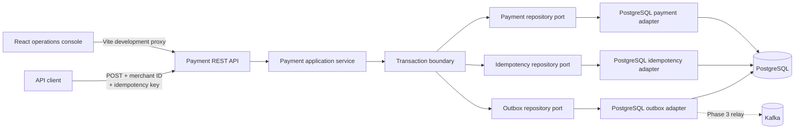
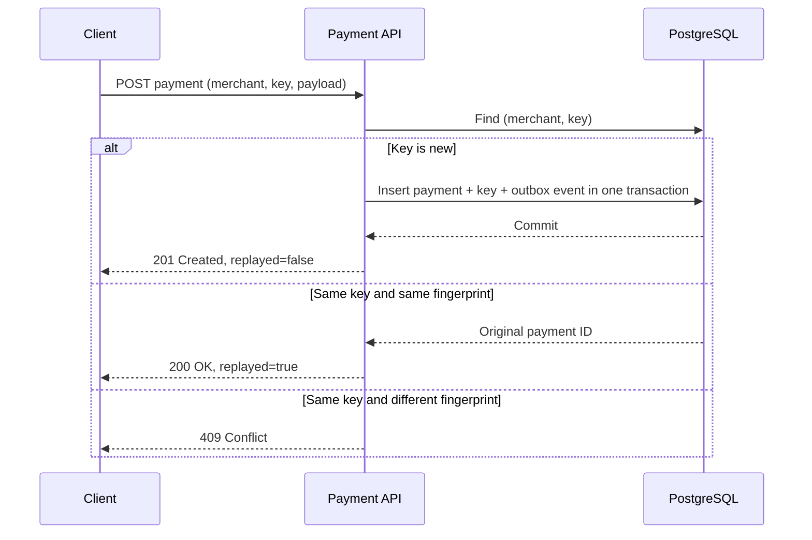
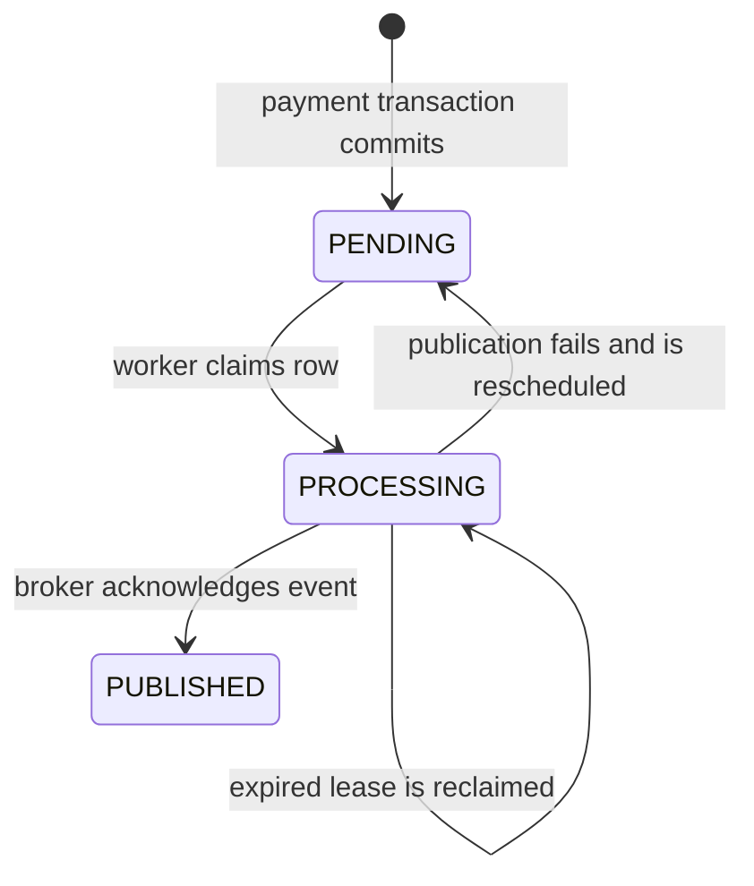

# Payment Reliability Lab

A production-minded Java and Spring Boot reference system for building payment APIs
that remain safe when clients retry requests, responses are lost, or multiple service
instances receive the same operation concurrently.

> **Reliability thesis:** delivery may happen more than once, but the business
> operation must have exactly one effect within the service and database boundary.

This is an independent portfolio project. It uses synthetic payment data and does
not contain employer code, confidential designs, or real payment credentials.

## Why this project exists

Creating a payment is easy on the happy path. The harder production question is
what happens when a client times out after the server commits and sends the same
request again. Without an idempotency contract, a normal retry can become a second
charge.

Payment Reliability Lab makes that failure mode explicit and demonstrates:

- merchant-scoped idempotency with request fingerprinting;
- atomic persistence of a payment, its idempotency record, and an outbox event;
- database-enforced duplicate protection across service instances;
- durable event staging with exclusive, recoverable relay claims;
- deterministic concurrency testing against real PostgreSQL;
- clear HTTP semantics for first attempts, safe replays, conflicts, and errors;
- hexagonal boundaries that keep domain logic independent of HTTP and PostgreSQL.

## Current capabilities

| Capability | Behavior |
| --- | --- |
| Create payment | Accepts an amount and ISO 4217 currency code and stores a payment in `RECEIVED` state. |
| Safe retry | An identical retry returns the original payment instead of creating another one. |
| Conflict detection | Reusing a key with different payment details returns `409 Conflict`. |
| Merchant isolation | The same idempotency key can be used independently by different merchants. |
| Concurrent duplicate protection | Competing requests converge on one committed payment, even across service instances. |
| Durable persistence | PostgreSQL stores payments and idempotency records in one transaction. |
| Schema management | Flyway applies versioned database migrations at startup and during tests. |
| Verification | Unit and integration tests run with JUnit 5, MockMvc, Testcontainers, and JaCoCo. |
| Operations console | A responsive React and TypeScript UI demonstrates creation, replay, conflict, and lookup behavior through the real API. |
| Transactional outbox | Every new payment stages one durable `PAYMENT_RECEIVED` event in the payment transaction; safe replays stage none. |
| Relay ownership | PostgreSQL workers claim batches exclusively, recover expired leases, and owner-check publication or rescheduling. |

## Architecture



The domain and application layers do not depend on Spring MVC or PostgreSQL.
Repository ports keep persistence replaceable, the API adapter owns HTTP concerns,
and a transaction decorator commits the payment, idempotency record, and outbox
event as one unit.

### Idempotent request flow



For simultaneous new requests, both transactions may initially see no record.
PostgreSQL's composite primary key on `(merchant_id, idempotency_key)` selects one
winner. The losing transaction rolls back its provisional payment, retries once in
a new transaction, and returns the committed payment as a replay.

This is an exactly-once **business effect inside one PostgreSQL boundary**, not a
claim of global exactly-once delivery. Kafka publication is at-least-once and
therefore requires consumer-side deduplication by event ID, introduced in Phase 3.

### Outbox lifecycle



Workers claim ordered batches with `FOR UPDATE SKIP LOCKED`, which lets multiple
instances make progress without claiming the same row. Publication and rescheduling
are guarded by worker ownership. If a worker stops after claiming, another worker
can recover the event after its lease expires.

The stored event payload is deliberately small and contains only the stable data a
consumer needs:

```json
{
  "eventId": "f35714c7-e520-4260-aaf9-203680fa7403",
  "paymentId": "7c02e8fe-9c21-4e13-81bc-b85185203b19",
  "merchantId": "demo-merchant",
  "amount": 42.50,
  "currency": "USD",
  "occurredAt": "2026-09-09T23:30:00Z"
}
```

## Technology stack

- Java 17
- Spring Boot 3.5
- Spring MVC, Bean Validation, JDBC, and Actuator
- PostgreSQL 17
- Flyway
- Docker Compose
- JUnit 5, MockMvc, Testcontainers, AssertJ, and Mockito
- JaCoCo with an enforced 80% line-coverage floor
- Maven
- React 19 and TypeScript 6
- Vite 8
- Vitest, Testing Library, ESLint, and V8 coverage

## Quick start

### Prerequisites

- Java 17 or newer
- Maven 3.9 or newer
- Docker Desktop or another Docker-compatible runtime with Compose
- `curl` for the examples

### 1. Clone and configure

```bash
git clone https://github.com/yasaswimandava/payment-reliability-lab.git
cd payment-reliability-lab
cp .env.example .env
```

The example credentials are for local development only. `.env` is ignored by Git.

### 2. Start PostgreSQL

```bash
docker compose up -d postgres
docker compose ps
```

The database listens on `127.0.0.1:55432` by default and stores data in a named
Docker volume so it survives container restarts.

### 3. Run the application

```bash
mvn spring-boot:run
```

Flyway creates the schema automatically. When the application is ready, verify it:

```bash
curl http://localhost:8080/actuator/health
```

Expected result:

```json
{"status":"UP"}
```

### 4. Run the operations console

In a second terminal:

```bash
cd frontend
npm install
npm run dev
```

Open [http://localhost:5173](http://localhost:5173). Vite proxies `/api` and
`/actuator` requests to Spring Boot on port `8080`, so local development does not
require permissive cross-origin configuration in the backend.

The console is designed to make the reliability contract visible:

1. Send the prefilled request to create a payment.
2. Send it again without changing the key or payload to observe a safe replay.
3. Change the amount but retain the key to observe an intentional `409 Conflict`.
4. Use the returned UUID to retrieve the durable payment record.

## Try the reliability behavior

### Create a payment

```bash
curl -i -X POST http://localhost:8080/api/v1/payments \
  -H 'Content-Type: application/json' \
  -H 'X-Merchant-Id: demo-merchant' \
  -H 'Idempotency-Key: demo-order-1001' \
  --data '{"amount":42.50,"currency":"USD"}'
```

The first request returns `201 Created` and `Idempotency-Replayed: false`:

```json
{
  "id": "7c02e8fe-9c21-4e13-81bc-b85185203b19",
  "merchantId": "demo-merchant",
  "amount": 42.50,
  "currency": "USD",
  "status": "RECEIVED",
  "createdAt": "2026-09-09T23:30:00Z",
  "replayed": false
}
```

Repeat the exact request. It returns `200 OK`,
`Idempotency-Replayed: true`, and the same payment ID.

Now reuse the key with a different amount:

```bash
curl -i -X POST http://localhost:8080/api/v1/payments \
  -H 'Content-Type: application/json' \
  -H 'X-Merchant-Id: demo-merchant' \
  -H 'Idempotency-Key: demo-order-1001' \
  --data '{"amount":99.00,"currency":"USD"}'
```

The API rejects the ambiguous operation with `409 Conflict` and an RFC 7807
problem response.

### Retrieve a payment

Replace `{payment-id}` with the ID returned by the create request:

```bash
curl -i http://localhost:8080/api/v1/payments/{payment-id}
```

An unknown UUID returns `404 Not Found` as an RFC 7807 problem response.

## API contract

### `POST /api/v1/payments`

Required headers:

| Header | Purpose |
| --- | --- |
| `X-Merchant-Id` | Identifies the merchant namespace for the operation. |
| `Idempotency-Key` | Stable client-generated key reused for retries of the same logical operation. |
| `Content-Type: application/json` | Declares the JSON request body. |

Request body:

| Field | Type | Rules |
| --- | --- | --- |
| `amount` | Decimal | Required, at least `0.01`, up to 12 integer digits and 2 fractional digits. |
| `currency` | String | Required, three uppercase letters and a currency recognized by the JVM. |

Responses:

| Status | Meaning |
| --- | --- |
| `201 Created` | A new payment was stored. |
| `200 OK` | An identical request was safely replayed. |
| `400 Bad Request` | Headers or body are invalid. |
| `409 Conflict` | The idempotency key was already used with different payment details. |

### `GET /api/v1/payments/{paymentId}`

| Status | Meaning |
| --- | --- |
| `200 OK` | The payment was found. |
| `404 Not Found` | No payment exists for the supplied UUID. |

## Configuration

| Variable | Default | Description |
| --- | --- | --- |
| `POSTGRES_DB` | `payment_lab` | Local database name. |
| `POSTGRES_USER` | `payment_lab` | Local database user. |
| `POSTGRES_PASSWORD` | `payment_lab_local` for the app | Database password; Compose requires it through `.env`. |
| `POSTGRES_PORT` | `55432` | Host port mapped to PostgreSQL. |
| `DB_URL` | `jdbc:postgresql://localhost:${POSTGRES_PORT}/${POSTGRES_DB}` | Full JDBC URL override. |

The Hikari connection pool is intentionally small for a local lab: maximum 10
connections, minimum 2 idle connections, and a 3-second connection timeout.

## Verification

Run the complete build:

```bash
mvn verify
```

The suite verifies:

- first-request creation and identical-request replay;
- rejection of a reused key with changed payment details;
- request validation and not-found behavior;
- durable payment and idempotency persistence;
- concurrent identical requests producing one stored payment;
- atomic creation of exactly one outbox event for a new payment and none for a replay;
- exclusive relay claims, lease recovery, rescheduling, and owner-checked publication;
- application behavior through unit and HTTP integration tests;
- every Flyway migration against an empty Testcontainers PostgreSQL database.

The build fails when line coverage drops below 80%. A Docker runtime must be
available because integration tests use a real PostgreSQL container rather than an
in-memory database.

Verify the frontend separately:

```bash
cd frontend
npm run test:coverage
npm run lint
npm run build
```

Frontend coverage has the same 80% minimum for statements, branches, functions,
and lines. Component tests exercise user-visible behavior, while API-client tests
verify request headers, replay detection, problem responses, and degraded errors.

## Project structure

```text
src/main/java/com/yasaswimandava/paymentlab/
├── api/                 REST controller, DTOs, and HTTP error mapping
├── application/         Use cases, idempotency policy, and application errors
├── domain/              Payment model and state
├── port/                Persistence interfaces
├── adapter/postgres/    JDBC repositories and transaction boundary
└── config/              Dependency wiring

src/main/resources/
├── application.yml      Runtime and actuator configuration
└── db/migration/        Versioned Flyway migrations

src/test/                Unit and PostgreSQL-backed integration tests
docs/decisions/          Architecture decision records
compose.yml              Local PostgreSQL environment

frontend/
├── src/App.tsx          Operations console and user workflows
├── src/lib/             Typed backend API client
├── src/*.test.tsx       Component behavior tests
├── src/styles.css       Responsive visual system
└── vite.config.ts       Local proxy, testing, and coverage configuration
```

## Failure scenarios and guarantees

| Scenario | Current behavior |
| --- | --- |
| Client loses the first response and retries | Returns the original payment with `replayed=true`. |
| Client changes the payload but reuses the key | Returns `409 Conflict`; no second payment is created. |
| Two instances race on the same new key | PostgreSQL selects one winner; the other transaction rolls back and replays the winner. |
| Database write fails before commit | The transaction rolls back both records. |
| Service restarts after commit | The durable idempotency record still resolves the retry. |
| Service crashes after committing a payment | The event remains durable in the outbox for a relay worker to publish. |
| Relay worker crashes after claiming an event | Another worker can reclaim it after the lease expires. |
| PostgreSQL is unavailable | The request fails; resilience and operator-facing error mapping are future work. |
| External provider accepts a charge but the response is lost | Not implemented yet; the provider boundary will require its own idempotency and reconciliation strategy. |

## Design decisions

- [ADR-001: Merchant-scoped idempotency](docs/decisions/ADR-001-merchant-scoped-idempotency.md)
- [ADR-002: Database-enforced concurrent idempotency](docs/decisions/ADR-002-database-enforced-concurrent-idempotency.md)
- [ADR-003: Transactional outbox for durable event publication](docs/decisions/ADR-003-transactional-outbox.md)

## Roadmap

The project is intentionally developed in reviewable milestones:

- [x] Payment API and domain model
- [x] Merchant-scoped idempotency and conflict detection
- [x] PostgreSQL persistence and Flyway migrations
- [x] Atomic writes and deterministic concurrency verification
- [x] React and TypeScript operations console
- [x] Transactional outbox and exclusive relay claims
- [ ] Kafka event processing and consumer idempotency
- [ ] Payment-provider simulator
- [ ] Timeouts, bounded retries, circuit breaker, and dead-letter queue
- [ ] OpenTelemetry traces, metrics, and structured logs
- [ ] Integration, fault-injection, and load-test scenarios
- [ ] CI pipeline and container image

Planned features are listed separately from implemented capabilities so the README
never overstates the system's current behavior.

## Production gaps

This lab focuses on reliability patterns, not a deployable payment processor. A
production system would also require authentication and authorization, secret
management, TLS, PCI-DSS controls, audit logging, rate limiting, data retention and
deletion policies, reconciliation, disaster recovery, multi-region design, and
formal operational service-level objectives.

Do not send cardholder data, bank details, credentials, or other sensitive
information to this application.

## Contributing

Small, focused changes are welcome. Before opening a pull request:

1. Add or update tests for behavior changes.
2. Run `mvn verify` with Docker available.
3. Update the README or add an ADR when a design decision changes.
4. Keep planned features clearly separated from implemented behavior.

## Author

Built by [Yasaswi Mandava](https://github.com/yasaswimandava) as a public system
design and backend reliability project.

- [Portfolio](https://yasaswimandava.github.io/portfolio/)
- [LinkedIn](https://www.linkedin.com/in/yasaswi-mandava-74a69a15a/)
